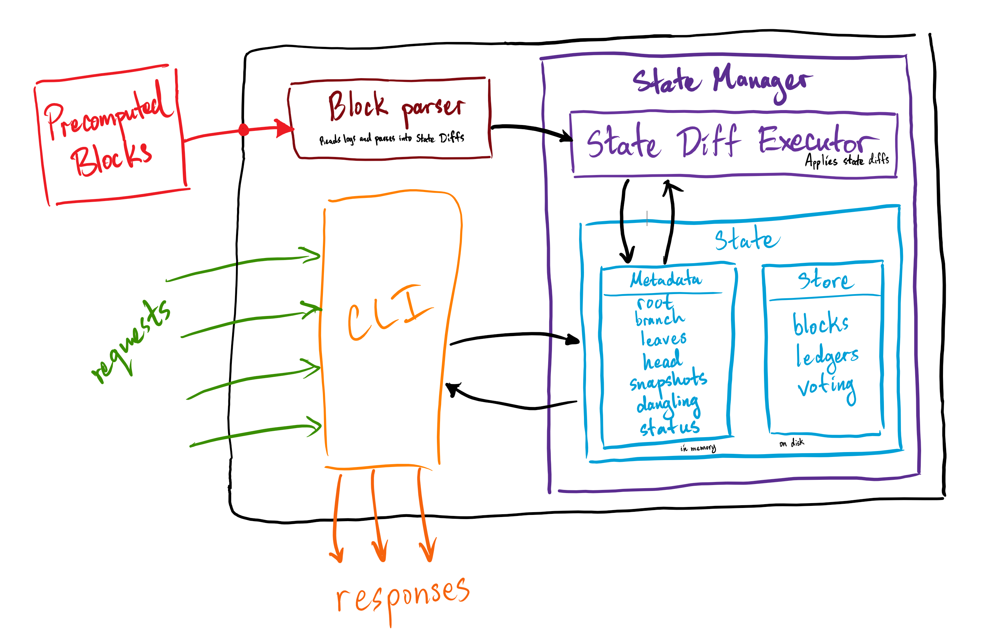

# Mina Indexer

[](https://github.com/Granola-Team/mina-indexer/actions/workflows/ci.yaml)
[](https://github.com/Granola-Team/mina-indexer/actions/workflows/audit.yaml)

The Mina indexer ("indexer") is a simplified, and improved version of
the software collectively called the "[archive
node](https://github.com/MinaProtocol/mina/tree/develop/src/app/archive)"
in the Mina codebase.

The indexer replaces the archive node trio of architectural elements
(Postgres database, Mina daemon, "mina-archiver" process) with a
system that reconstitutes the network’s historical state solely from
the precomputed blocks logged from the Mina daemon.



The indexer's primary goals are to be easier to operate and maintain
while being a superset of the data available in the archive node.

## Warning

The indexer project is in constant development and is in an alpha
state. Functionality and API definitions will be in flux and are
subject to change without notice. With that being said, happy hacking!

## Getting Started

Clone the repo

```sh
git clone git@github.com:Granola-Team/mina-indexer.git
cd mina-indexer
```

Build (install [nix](#about-the-development-environment) first)

```sh
nix develop
nix build '.?submodules=1'
```

Start the `mina-indexer` server with

* `--genesis-ledger`, `-g`
  * genesis ledger `.json` file to use to initialize the indexer
* `--root-hash`, `-r`
  * state hash of the genesis block
  * defaults to mainnet genesis state hash `3NKeMoncuHab5ScarV5ViyF16cJPT4taWNSaTLS64Dp67wuXigPZ`
* `--startup-dir`, `-s`
  * directory of precomputed blocks to initialize the indexer's state
* `--watch-dir`, `-w`
  * directory the block receiver watches to keep the indexer up to date
* `--database-dir`, `-d`
  * directory to store the indexer's internal RocksDB database
* `--log-dir`, `-l`
  * directory to output the indexer's logs
  * defaults to `stdout`

```sh
mina-indexer server --genesis-ledger PATH \
    --root-hash STATE_HASH \
    --startup-dir PATH \
    --watch-dir PATH \
    --database-dir PATH \
    --log-dir PATH
```

Query data with the `mina-indexer` client

* Get the account info for a specific Public Key
```sh
mina-indexer client account --public-key PUBLIC_KEY
```

* Get the best (most likely canonical) blockchain
```sh
mina-indexer client best-chain
```

* Dump the best ledger to a file
```sh
mina-indexer client best-ledger --path PATH
```

* Get a summary of the indexer state
```sh
mina-indexer client summary
```

For more information, check out the help menus

```sh
mina-indexer server --help
mina-indexer client --help
```

## About the development environment

This repository uses Nix Flakes as a development environment and build system. You can install Nix [here](https://nixos.org/download.html) Sand you can visit [this page](https://nixos.wiki/wiki/Flakes) for instructions on enabling Nix Flakes on your system. Apart from Nix, there are no external dependencies for this project!

## Building the Project

Binaries for `mina-indexer` can be built by running `nix build '.?submodules=1'` with Flakes enabled (see above). All binaries are output to `./result/bin`

## Entering a Development Environment

You can enter a development environment by running `nix develop` at the command line. The development environment for this project takes care of installing all dependencies, compilers, and development tools (this means that you don't even need rustup installed!), including the `rust-analyzer` language server. For VSCode, we recommend the `Nix Environment Selector` extension pointed at `shell.nix` to tell your IDE about the installed tools, though you can also use direnv for this same purpose.

## Running unit tests

In the nix shell issue the following command to run the unit tests.

`cargo nextest run`

## License (See LICENSE file for full license)

Copyright 2022-2023 Mina Foundation, Inc.

Free use of this software is granted under the terms of the Mozilla
Public License 2.0.
