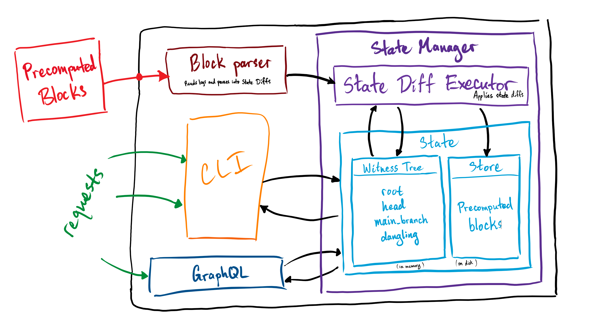

# Mina Indexer

[](https://github.com/Granola-Team/mina-indexer/actions/workflows/ci.yaml)
[](https://github.com/Granola-Team/mina-indexer/actions/workflows/audit.yaml)

The Mina indexer ("indexer") is a simplified, and improved version of
the software collectively called the "[archive
node](https://github.com/MinaProtocol/mina/tree/develop/src/app/archive)"
in the Mina codebase.

The indexer replaces the archive node trio of architectural elements
(Postgres database, Mina daemon, "mina-archiver" process) with a
system that reconstitutes the network’s historical state solely from
the precomputed blocks logged from the Mina daemon.



The indexer's primary goals are to be easier to operate and maintain
while being a superset of the data available in the archive node.

## Warning

The indexer project is in constant development and is in an alpha
state. Functionality and API definitions will be in flux and are
subject to change without notice. With that being said, happy hacking!

## Getting Started

Clone the repo

```sh
git clone https://github.com/Granola-Team/mina-indexer.git
cd mina-indexer
```

Build (install [nix](#about-the-development-environment) first)

```sh
nix develop
nix build '.?submodules=1'
```

Run `mina-indexer` using logs from `PATH`

```sh
mina-indexer run --logs-dir PATH
```

Get `PUB_KEY`'s balance

```sh
mina-indexer account balance --pub-key PUB_KEY
```

For more commands, check out the help menu

```sh
mina-indexer help
```

## About the development environment

This repository uses Nix Flakes as a development environment and build system. You can install Nix [here](https://nixos.org/download.html) Sand you can visit [this page](https://nixos.wiki/wiki/Flakes) for instructions on enabling Nix Flakes on your system. Apart from Nix, there are no external dependencies for this project!

## Building the Project

Binaries for `mina-indexer` can be built by running `nix build '.?submodules=1'` with Flakes enabled (see above). All binaries are output to `./result/bin`

## Entering a Development Environment

You can enter a development environment by running `nix develop` at the command line. The development environment for this project takes care of installing all dependencies, compilers, and development tools (this means that you don't even need rustup installed!), including the `rust-analyzer` language server. For VSCode, we recommend the `Nix Environment Selector` extension pointed at `shell.nix` to tell your IDE about the installed tools, though you can also use direnv for this same purpose.

## Running unit tests

In the nix shell issue the following command to run the unit tests.

`cargo nextest run`

## License (See LICENSE file for full license)

Copyright 2022-2023 Mina Foundation, Inc.

Free use of this software is granted under the terms of the Mozilla
Public License 2.0.
