# Adding blocks to the witness tree

Here's a visualization of a general block witness tree (drawn
horizontally, slot numbers increase to the right)

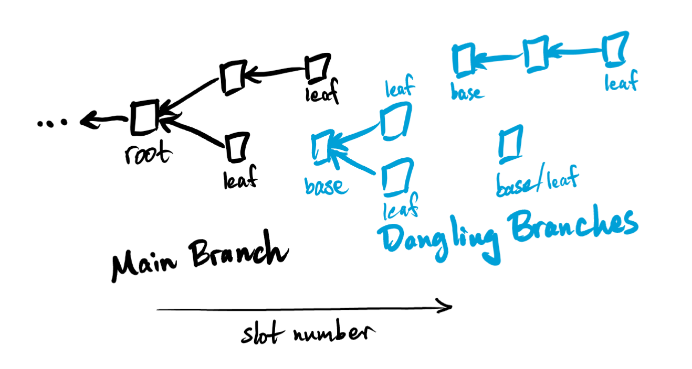

There are several scenarios which can occur while adding a block to
the witness tree. They fall broadly into two categories, *simple* and
*complex*, each with several subcategories.

For reference, the `Branch` and `Leaf` data structures are something
like

```rust
struct Branch {
  paths: Vec<Path>,
  leaves: Vec<Leaf>,
}

struct Leaf {
  state_hash: String,
  ledger: Option<Ledger>,
}

type Path = Vec<EssentialBlockData>
```

The `ledger` field is optional because main branch leaves have some
ledger and dangling branch leaves have none.

## Simple Extensions

Simple extensions either increase the length of a branch's path(es) by
1 (*proper*) or increase the number of paths in a branch by 1
(*improper*). A simple extension does not decrease the number of
connected components of the witness tree. Both the main branch and
dangling branches can be simply extended.

### Simple main branch extensions

#### Simple proper main branch extension

The incoming block is a *child of a leaf block* in the main branch and
not a parent of any base blocks of the dangling branches. Adding this
block will extend one of the paths on the main branch, increasing it's
length by 1.

- new leaf replaces an old one in the main branch's leaves
- new leaf is appended to an existing path in the main branch's paths
- head and root are updated if necessary
- dangling branches are unchanged

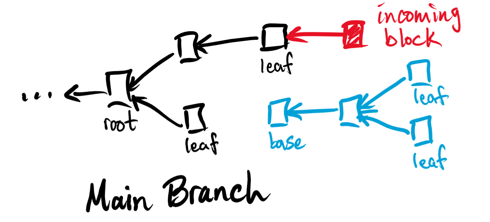

#### Simple improper main branch extension

The incoming block is a *child of a non-leaf block* in the main branch
and not a parent of any base blocks of the dangling branches. Adding
this block will create a new path on the main branch.

- new leaf is appended to the main branch's leaves
- new path is appended to the main branch's paths
- head and root are updated if necessary
- dangling branches are unchanged

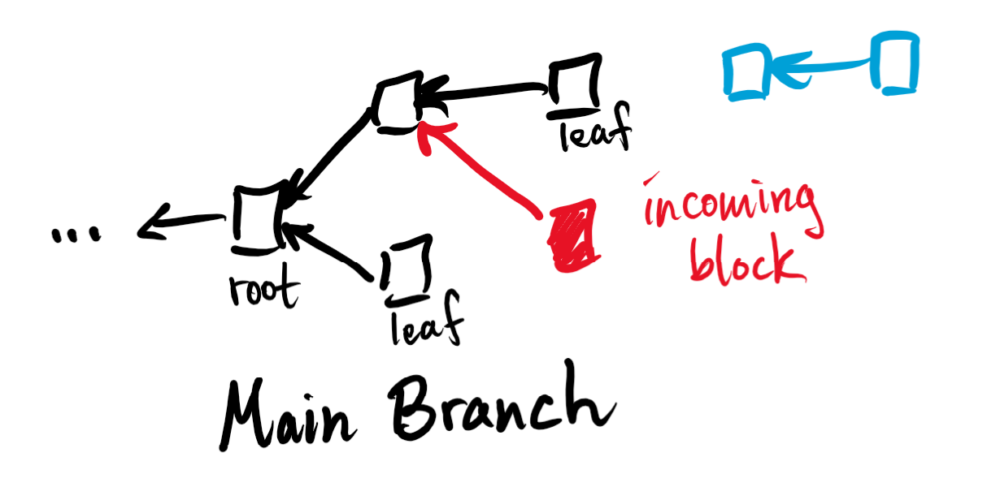

### Simple dangling branch extensions

Since dangling branches are disjoint from the main branch, they can be
properly extended in either direction, *forward* or *backward*.

#### Simple proper forward dangling branch extension

The incoming block is a *child of a leaf block* in a dangling branch
and not a parent of any base blocks of the other dangling
branches. Adding this block will extend one of the paths on the
dangling branch, increasing it's length by 1.

- new leaf replaces an old one in the dangling branch's leaves
- new leaf is appended to an existing path in the dangling branch's
  paths
- root and main branch are unchanged

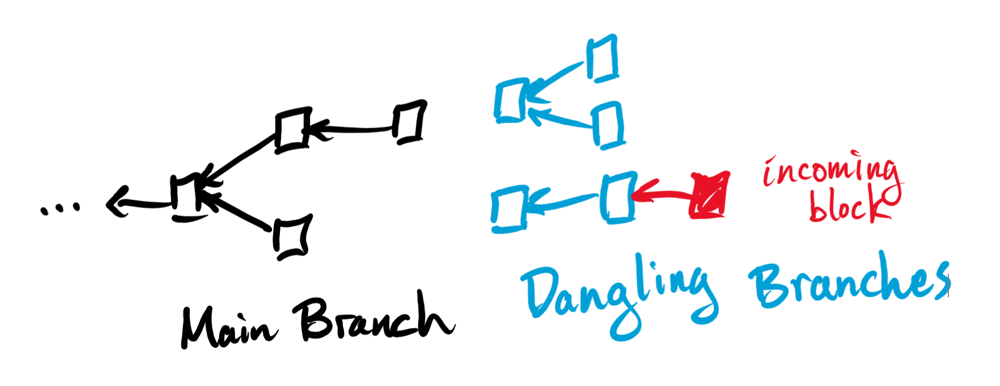

#### Simple proper backward dangling branch extension

The incoming block is the *parent of the base block* in a dangling
branch and not a child of any known block in the witness tree. Adding
this block increases the lengths of all pathes in the dangling branch
by 1 by adding a new base to the branch.

- new base is prepended to all existing paths in the dangling branch
- head, root, and main branch are unchanged

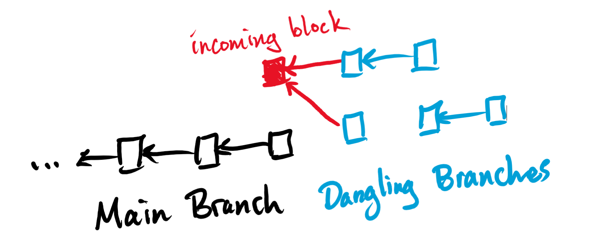

#### Simple improper dangling branch extension

Similar to the simple improper extension of the main branch, the
incoming block is a *child of a non-leaf block* in a dangling branch
and not a parent of any base blocks of the other dangling
branches. Adding this block will create a new path on the dangling
branch.

- new leaf is appended to the dangling branch's leaves
- new path is appended to the dangling branch's paths
- head, root, and main branch are unchanged

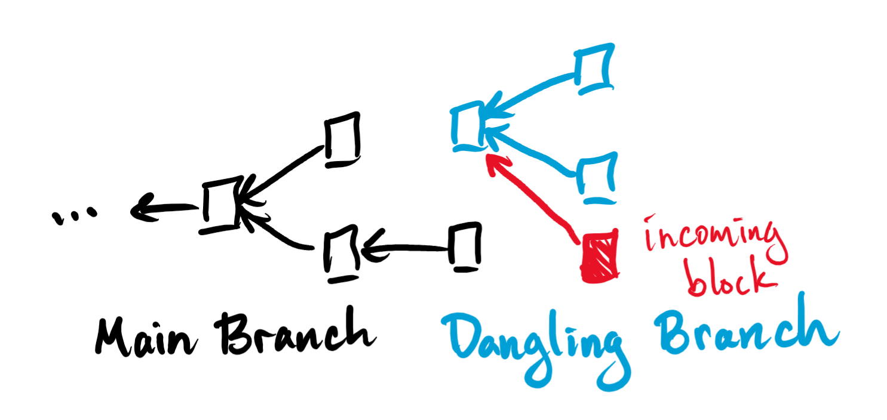

### Other simple extensions

It is also possible for the incoming block to be disjoint from all
existing branches. There are two possibilities for this scenario:

#### Incoming block starts a new dangling branch in the witness tree

The incoming block is *not a parent or child of any block in the
witness tree*, its *height is above our current root*, and it is *not
a child of a pruned block*. This block starts a new dangling branch.

- new dangling branch appended to existing dangling branches
- head, root, and main branch are unchanged

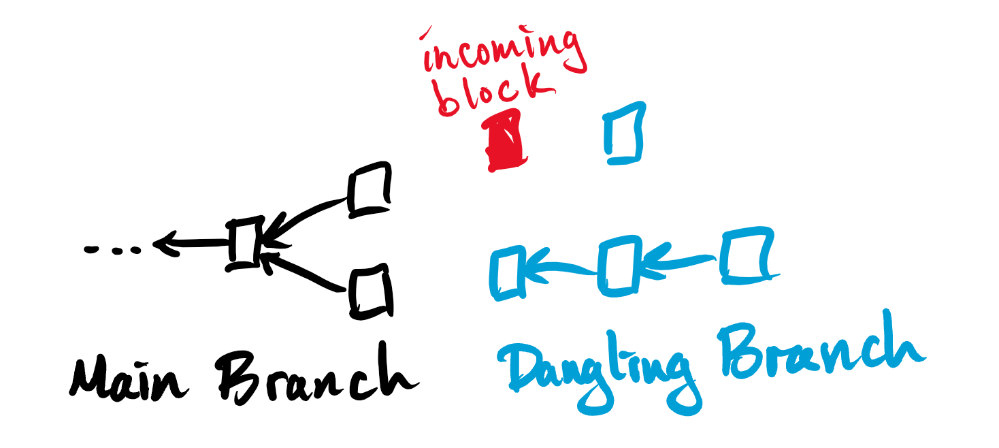

#### Incoming block can bypass the witness tree

The incoming block has a *lower height than our current root* or is a
*child of a pruned block*. This block can go immediately to the
*store*, bypassing the witness tree altogether.

- witness tree is unchanged
- block is added to the store

## Complex Extensions

Complex extensions merge different components of the block witness
tree together, decreasing the number of connected components. A merge
can happen between the main branch and a dangling branch (*complex
main branch extension*) or between two dangling branches (*complex
dangling branch extension*). Similar to simple extensions, complex
extensions can be either *proper* or *improper*, depending on whether
the extension point is a leaf.

### Complex main branch extensions

All dangling branch bases have height at or above the current root so
it is not possible for a block to be a child of a dangling branch
block and a parent of the root.

#### Complex proper main branch extension

The incoming block is a *child of a main branch leaf and a parent of
one or more dangling branch bases*. This results in a merge of the
main branch and the dangling branches which requires updating the
previously dangling branches' leaf ledgers and including the
previously dangling leaves and paths into the main branch.

Note: It is not possible for the block to be a parent of a non-base
dangling branch block because each block has exactly one
parent. However, it is possible for the block to be a parent of
multiple dangling branch bases because a block can have several
children.

- the dangling branches' leaf ledgers are updated according to their
  new paths
- the dangling branches' updated leaves are appended to the main
  branch's leaves
- new paths are accordingly appended to the main branch's paths
- the dangling branches are dropped
- root and head are updated if necessary

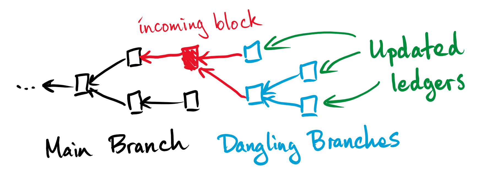

#### Complex improper main branch extension

The incoming block is a *child of a main branch non-leaf block and a
parent of one or more dangling branch bases*. This results in a merge
of the main branch and the dangling branches which requires updating
the previously dangling branches' leaf ledgers and including the
previously dangling leaves and paths into the main branch.

- the dangling branches' leaf ledgers are updated according to their
  new paths
- the dangling branches' updated leaves are appended to the main
  branch's leaves
- new paths are accordingly appended to the main branch's paths
- the dangling branches are dropped
- root and head are updated if necessary

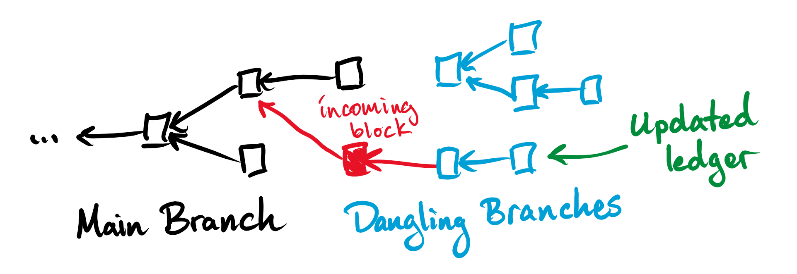

### Complex dangling branch extensions

#### Complex proper dangling branch extension

The incoming block is a *child of a dangling branch's leaf and a
parent of one or more dangling branch bases*. This results in a merge
of the dangling branches which requires consolidating the upper
dangling branches' leaves and paths into the base branch.

- the upper dangling branches' leaves are appended to the base
  branch's leaves
- new paths are accordingly appended to the base branch's paths
- the upper dangling branches are dropped
- root, head, and main branch are unchanged

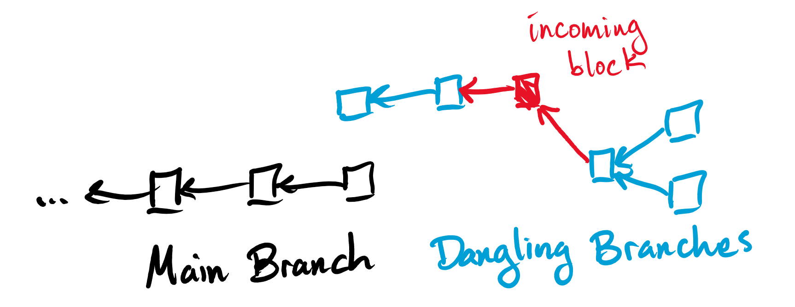

#### Complex improper dangling branch extension

The incoming block is a *child of a dangling branch's non-leaf block
and a parent of one or more dangling branch bases*. This results in a
merge of the dangling branches which requires consolidating the upper
dangling branches' leaves and paths into the base branch.

- the upper dangling branches' leaves are appended to the main
  branch's leaves
- new paths are accordingly appended to the main branch's paths
- the upper dangling branches are dropped
- root, head, and main branch are unchanged

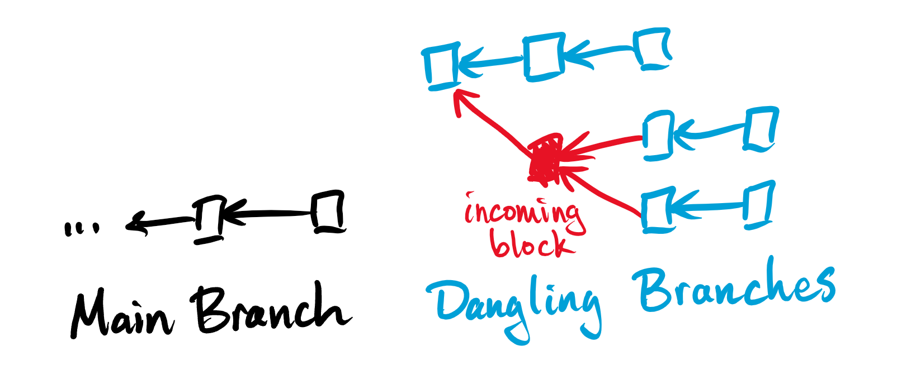
