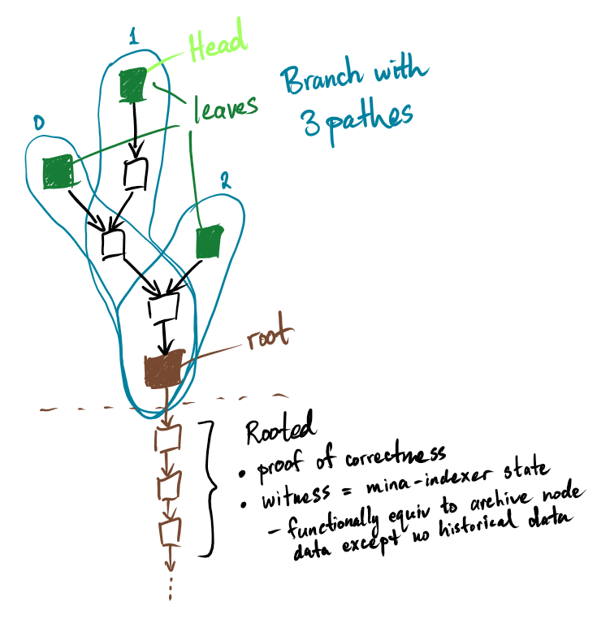
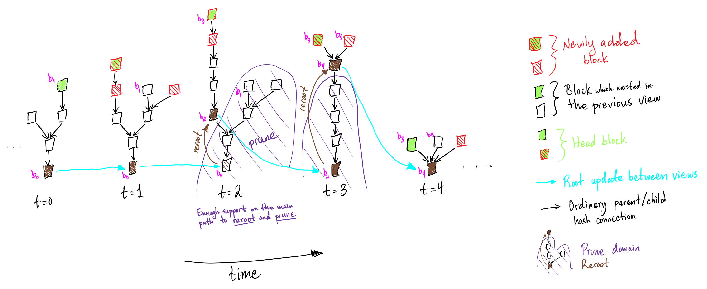

# [Mina Indexer / State] Block Witness Tree

Each block in Mina can only have a single parent. Several blocks can be produced in each slot. The overall structure is a **tree**.

Our indexer consumes block logs to build an in-memory witness (**block witness tree**) and indexed data structure of *leaf ledgers*.

This *block witness tree* is like a merkle tree which evolves over time, in the sense that as it grows, the root can be moved up and everything below it pruned (i.e. only the block logs are stored, we drop the in-memory representation).

The idea is that sufficient consensus is built around a canonical chain so we only need to track the data corresponding to that chain. It's what is called *Rooted* in the image below.

## Branch, Paths, Root, Leaves, and Head

- **root** is a `BlockHash` representing the latest block we are effectively certain about
- **branch** is a *rooted union* of *paths*, i.e. they all start at the same *root*
- **path** is a `Vec<BlockHash>` representing a valid trace of state updates
  - begins at the root and ends at a unique leaf
  - the corresponding blocks are stored in separate hash-keyed data structure (e.g. hash map)
- **leaf** represents a view of reality and contains a concrete, up-to-date ledger, the result of unfolding its path

## Evolution

As time progresses and the indexer parses more block logs, block hashes are added to the *block witness tree*, the root updates, and non-canonical in-memory blocks are pruned (among other things orthogonal to the block witness tree)

